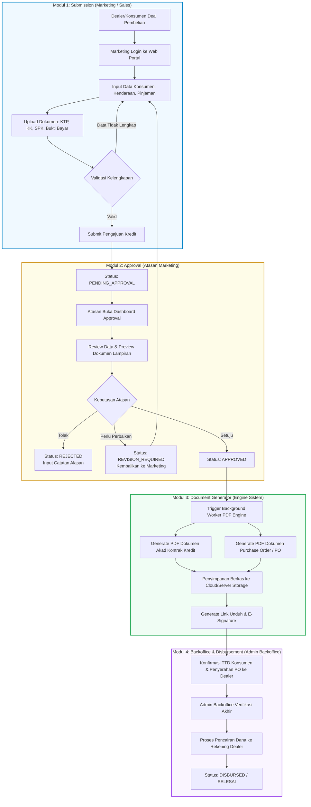

# Rancangan Program Berbasis Web untuk Digitalisasi Kredit Kendaraan Bermotor
**Studi Kasus: PT. JKL**

Dokumen ini berisi analisis proses bisnis, perancangan modul, diagram alir sistem (*Module Flow*), dan siklus status (*Lifecycle*) pengajuan kredit kendaraan bermotor berbasis web untuk menggantikan proses operasional manual.

---

## 1. Analisis Proses: Manual (*As-Is*) vs Digital (*To-Be*)

| Titik Proses | Proses Manual Lama (*As-Is*) | Solusi Digitalisasi Baru (*To-Be*) |
| :--- | :--- | :--- |
| **Input & Dokumen** | Form kertas, fotokopi fisik KTP/KK/SPK/Bukti Bayar, rentan hilang & tercecer. | **Modul Submission**: Formulir web terpusat + upload berkas digital (JPG/PDF) dengan validasi ukuran dan format otomatis. |
| **Penyampaian Berkas** | Marketing membawa berkas fisik ke meja Atasan Marketing. | Notifikasi real-time & antrean digital terpusat di **Dashboard Approval**. |
| **Persetujuan (Approval)** | Tanda tangan fisik lembar memo, tidak ada histori/audit trail yang terpusat. | Verifikasi digital 1-klik dengan catatan/alasan penolakan & audit log sistem. |
| **Pembuatan PO & Kontrak** | Admin Backoffice mengetik ulang data dan mencetak fisik (*print* kertas). | **Modul Document Generator**: Sistem otomatis mengisi template dinamis dan menerbitkan PDF Kontrak & PO seketika saat status *Approved*. |
| **Penandatanganan & PO** | Marketing membawa fisik lembar kontrak ke konsumen dan fisik PO ke dealer. | Dokumen PDF dikirim via portal/WhatsApp/email dengan integrasi *E-Signature* / unggah bukti TTD digital. |
| **Pencairan Dana** | Menunggu arsip fisik diserahkan kembali ke Backoffice secara manual. | Status berubah menjadi *Ready to Disburse*, Backoffice memverifikasi kelengkapan digital dan mengeksekusi pencairan ke rekening dealer. |

---

## 2. Arsitektur Sistem (Modul Web)

Sistem web digitalisasi PT. JKL dibagi menjadi 4 modul utama:

```
+---------------------------------------------------------------------------------+
|                         SISTEM APLIKASI WEB KREDIT PT. JKL                      |
+--------------------+---------------------+--------------------+-----------------+
| 1. Submission      | 2. Approval         | 3. Doc Generator   | 4. Backoffice   |
| (Marketing/Sales)  | (Atasan Marketing)  | (Engine Otomatis)  | (Admin Kasir)   |
|--------------------|---------------------|--------------------|-----------------|
| - Data Konsumen    | - List Antrean      | - Auto Trigger PDF | - Rekapitulasi  |
| - Data Kendaraan   | - Detail Verifikasi | - PO Dealer PDF    | - Verifikasi    |
| - Data Pinjaman    | - Action:           | - Kontrak Pembiayaan|  Akhir Berkas   |
| - Upload Dokumen   |   Approve/Reject/   | - Notifikasi & Link| - Eksekusi      |
|   (KTP, KK, dll)   |   Revise            |   Download/E-Sign  |   Pencairan     |
+--------------------+---------------------+--------------------+-----------------+
```

---

## 3. Diagram Alur Kerja Modul (*End-to-End Module Flow*)



---

## 4. Rincian Spesifikasi & Data Antar Modul

### Modul 1: Submission (Marketing / Sales)
Fokus pada kemudahan pengisian form (*user friendly*) dan validasi data secara instan:
- **Data Konsumen**:
  - NIK (validasi 16 digit angka)
  - Nama Lengkap (sesuai KTP)
  - Tanggal Lahir (validasi batas usia minimal pembiayaan, misal 21 tahun)
  - Status Perkawinan (`Belum Kawin`, `Kawin`, `Cerai`)
  - Data Pasangan (Nama & NIK Pasangan, otomatis muncul jika status `Kawin`)
- **Data Kendaraan**:
  - Nama Dealer Rekanan
  - Merk Kendaraan (Honda, Yamaha, Suzuki, Kawasaki, dll)
  - Model & Tipe Kendaraan
  - Pilihan Warna Kendaraan
  - Harga OTR (*On The Road*)
- **Data Pinjaman & Simulasi Finansial**:
  - Down Payment (DP): Input nominal atau persentase (min. 10%-20%)
  - Tenor / Lama Kredit (12, 24, 36, 48 bulan)
  - Jenis Asuransi (All Risk / TLO / Kombinasi)
  - Perhitungan Otomatis: Pokok Pinjaman & Angsuran per Bulan
- **Dokumen Pendukung (File Upload)**:
  - Foto KTP Pemohon
  - Kartu Keluarga (KK)
  - Surat Pesanan Kendaraan (SPK) dari Dealer
  - Bukti Bayar Tanda Jadi (Kuitansi / Bukti Transfer)
  - *Format yang didukung*: JPG, PNG, PDF (maksimal 5MB per berkas).

---

### Modul 2: Dashboard Approval (Atasan Marketing)
Fokus pada kecepatan pengambilan keputusan kredit dengan data analitik terpadu:
- **Tampilan Metrik Ringkas**:
  - Total Pengajuan Masuk Hari Ini
  - Pengajuan Menunggu Review (*Pending*)
  - Total Disetujui (*Approved*) & Ditolak (*Rejected*)
- **Tabel Antrean Pengajuan**:
  - Filter berdasarkan Dealer, Rentang Tanggal, Plafon Pinjaman, dan Tenor.
  - Sorting berdasarkan prioritas pengajuan terlama.
- **Panel Modal Review Terpadu (*Split-view*)**:
  - Sisi Kiri: Rincian profil konsumen, ringkasan kalkulasi pinjaman, dan rasio angsuran terhadap profil risiko.
  - Sisi Kanan: Berkas dokumen asli yang dapat di-*zoom* dan diinspeksi keasliannya.
- **Tindakan Persetujuan**:
  - **Approve**: Memberikan catatan persetujuan dan langsung mengarahkan pengajuan ke *Modul Document Generator*.
  - **Reject**: Wajib memilih alasan penolakan (misal: riwayat kredit bermasalah, kapasitas angsuran tidak memadai, dokumen terindikasi palsu).
  - **Request Revision**: Mengembalikan status ke Marketing untuk perbaikan dokumen tertentu tanpa harus mengulang input dari awal.

---

### Modul 3: Document Generator (Otomatisasi PDF)
Fokus pada efisiensi tanpa ada re-entry data dan mengurangi *paper waste*:
- **Pemicu (*Trigger*)**: Otomatis aktif saat pengajuan berstatus `APPROVED`.
- **Output Dokumen**:
  1. **Dokumen Purchase Order (PO)**: Berisi persetujuan pembiayaan ke dealer, rincian unit motor, nilai tagihan pencairan, dan termin pembayaran.
  2. **Dokumen Kontrak Perjanjian Pembiayaan**: Dokumen perjanjian kredit formal antara PT. JKL dan Konsumen, memuat jadwal angsuran, hak & kewajiban, serta pasal fidusia.
- **Mekanisme Distribusi**:
  - Dokumen langsung terbit dalam format PDF terstandar dengan *Watermark* resmi dan Kode QR otentikasi.
  - Tautan dokumen siap diunduh oleh Sales/Dealer dan dikirimkan ke Konsumen via WhatsApp/Email.

---

### Modul 4: Backoffice & Pencairan Dana (Admin Backoffice)
- **Verifikasi Akhir**: Memeriksa konfirmasi tanda tangan kontrak digital dan kesiapan unit di dealer.
- **Eksekusi Pencairan**: Mengonfirmasi jadwal pencairan dana dari PT. JKL ke rekening dealer rekanan.
- **Arsip Digital**: Seluruh dokumen dan riwayat transaksi tersimpan secara aman dalam sistem terpusat untuk kebutuhan audit di masa depan.

---

## 5. Diagram Status Pengajuan (*State Lifecycle*)

```
               +-------------------+
               |       DRAFT       |
               +---------+---------+
                         | Submit
                         v
             +-----------+-----------+
             |   PENDING_APPROVAL    | <-----------------+
             +-----+-----------+-----+                   |
                   |           |                         |
       Approve     |           | Reject                  | Revisi Diperbaiki
          +--------+           +--------+                |
          |                             |                |
          v                             v                |
   +------+------+               +------+------+         |
   |  APPROVED   |               |  REJECTED   |         |
   +------+------+               +-------------+         |
          |                                              |
          | (Auto Trigger PDF)                           |
          v                                              |
   +------+------+               +-------------------+   |
   | DOC_READY   |               | REVISION_REQUIRED +---+
   +------+------+               +-------------------+
          |
          | (TTD & Konfirmasi PO)
          v
+---------+---------+
| READY_DISBURSE    |
+---------+---------+
          |
          | (Pencairan Dana)
          v
   +------+------+
   |  DISBURSED  | (Selesai)
   +-------------+
```
