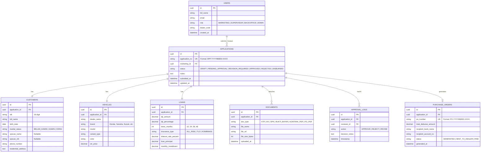

# Product Skeleton: Sistem Digitalisasi Kredit Kendaraan Bermotor (PT. JKL)

Dokumen **Product Skeleton** ini merangkum arsitektur produk menyeluruh untuk platform web pembiayaan kendaraan bermotor PT. JKL. Dokumen ini menjadi acuan blueprint teknis, model data, arsitektur modul frontend/backend, kontrak API, serta hierarki komponen antarmuka.

---

## 1. Ikhtisar Produk (*Product Overview*)

- **Nama Platform**: PT. JKL AutoCredit Web System
- **Objektif Utama**: Menggantikan proses manual (kertas fisik, tanda tangan basah, kurir dokumen, kalkulasi manual) dengan ekosistem digital terpadu berbasis web dari penyerahan berkas hingga penerbitan PO & pencairan dana.
- **Pengguna & Peran (Role-Based Access Control / RBAC)**:
  1. **Sales / Marketing**: Menginput pengajuan konsumen, kalkulasi simulasi kredit, dan unggah berkas pendukung.
  2. **Atasan Marketing (Credit Supervisor / Manager)**: Memeriksa kelayakan calon debitur, memverifikasi dokumen pendukung, dan memberikan keputusan (*Approve / Reject / Revise*).
  3. **Admin Backoffice / Finance**: Memverifikasi dokumen kontrak digital, mencetak/mendistribusikan PO digital, dan memproses pencairan dana (*disbursement*) ke dealer rekanan.
  4. **Super Admin**: Manajemen master data (dealer, suku bunga, limit plafon, manajemen pengguna).

---

## 2. Peta Arsitektur Informasi (*Sitemap & User Flow*)

```
[ Portal PT. JKL ]
  │
  ├── /auth/login (Autentikasi Multi-Role)
  │
  ├── /marketing (Role: Marketing)
  │     ├── /dashboard (Statistik performa sales, status aplikasi aktif)
  │     ├── /submission/new (Multi-Step Form: Konsumen -> Kendaraan -> Pinjaman -> Upload)
  │     ├── /submission/history (Riwayat pengajuan + status real-time)
  │     └── /submission/[id]/edit (Perbaikan berkas bila terkena status REVISION_REQUIRED)
  │
  ├── /approval (Role: Atasan Marketing)
  │     ├── /dashboard (Metrik approval, antrean pending, SLA pengajuan)
  │     ├── /review/[id] (Split-view data review, PDF/Image previewer, Action modal)
  │     └── /history (Log riwayat persetujuan & penolakan beserta alasan)
  │
  ├── /backoffice (Role: Admin Backoffice)
  │     ├── /disbursement-queue (Daftar aplikasi APPROVED siap cair)
  │     ├── /documents/[id] (Download PO resmi & Kontrak Digital)
  │     └── /disbursement/[id]/process (Input nomor referensi transfer dana)
  │
  └── /api/v1 (Backend Endpoints & Auto Document Worker)
```

---

## 3. Desain Model Data & ERD (*Entity Relationship*)



---

## 4. Struktur Folder Proyek (Nuxt 3 / Vue 3)

Rekomendasi implementasi modular di dalam direktori proyek:

```
nuxt-app/
├── app/
│   ├── app.vue                        # Shell utama aplikasi
│   ├── assets/
│   │   └── css/
│   │       ├── main.css               # Design tokens, palet warna, tipografi Inter
│   │       └── components.css         # Styling reusable cards, buttons, badges
│   │
│   ├── components/
│   │   ├── common/
│   │   │   ├── AppHeader.vue          # Navbar, identitas user & switch role demo
│   │   │   ├── StatusBadge.vue        # Tag status (Pending, Approved, Rejected)
│   │   │   └── ModalContainer.vue     # Modal wrapper universal
│   │   │
│   │   ├── submission/
│   │   │   ├── StepProgress.vue       # Indikator langkah 1-4
│   │   │   ├── CustomerDataForm.vue   # Input NIK, Nama, Tanggal Lahir, Status Kawin
│   │   │   ├── VehicleDataForm.vue    # Pilihan Dealer, Merk, Model, Harga OTR
│   │   │   ├── LoanCalculatorForm.vue # Slider DP, Tenor, Asuransi, Auto-Angsuran
│   │   │   └── DocumentUploader.vue   # Drag-drop file (KTP, KK, SPK, Bukti Bayar)
│   │   │
│   │   ├── approval/
│   │   │   ├── MetricCards.vue        # Statistik Total, Pending, Disetujui
│   │   │   ├── ApprovalTable.vue      # Tabel antrean & pencarian pengajuan
│   │   │   ├── ApplicationDetail.vue  # Panel inspeksi data debitur
│   │   │   ├── DocumentViewer.vue     # Lightbox / viewer berkas KTP & KK
│   │   │   └── ActionDialog.vue       # Modal konfirmasi Approve / Input alasan Reject
│   │   │
│   │   └── generator/
│   │       ├── DocumentPreview.vue    # Preview otomatis lembar PDF Kontrak & PO
│   │       └── DownloadAction.vue     # Tombol unduh berkas digital
│   │
│   ├── composables/
│   │   ├── useCreditCalculator.ts     # Logika rumus pokok hutang & angsuran
│   │   ├── useApplications.ts         # State management antrean pengajuan
│   │   └── useDocumentGenerator.ts    # Template rendering dokumen PO & Kontrak
│   │
│   └── pages/
│       ├── index.vue                  # Landing / Portal Switcher
│       ├── submission/
│       │   └── index.vue              # Halaman Form Input Pengajuan (Marketing)
│       └── approval/
│           └── index.vue              # Halaman Dashboard Approval (Atasan Marketing)
│
├── docs/
│   ├── module_flow.md                 # Alur proses modul & state lifecycle
│   └── product_skeleton.md            # Cetak biru arsitektur teknis produk
└── server/
    └── api/                           # Endpoint backend Nuxt server
```

---

## 5. Spesifikasi Kontrak API (*API Contract*)

### A. Modul Submission
- `POST /api/v1/submissions`
  - **Body Payload**:
    ```json
    {
      "customer": {
        "nik": "3201123456780001",
        "fullName": "Budi Santoso",
        "birthDate": "1994-08-17",
        "maritalStatus": "KAWIN",
        "spouseName": "Siti Rahma",
        "spouseNik": "3201123456780002",
        "phoneNumber": "081234567890",
        "address": "Jl. Melati No. 12, Jakarta"
      },
      "vehicle": {
        "dealerName": "Dealer Nusantara Jaya Motor",
        "brand": "Honda",
        "model": "Vario 160",
        "variantType": "CBS",
        "color": "Matte Black",
        "otrPrice": 27500000
      },
      "loan": {
        "dpAmount": 5500000,
        "dpPercentage": 20,
        "tenorMonths": 36,
        "insuranceType": "ALL_RISK",
        "monthlyInstallment": 985000
      }
    }
    ```
  - **Response 201 Created**:
    ```json
    {
      "success": true,
      "applicationId": "APP-20260915-0012",
      "status": "PENDING_APPROVAL",
      "message": "Pengajuan berhasil dikirim ke antrean review Atasan Marketing."
    }
    ```

- `POST /api/v1/submissions/:id/documents`
  - **Header**: `multipart/form-data`
  - **Fields**: `docType` (`KTP` | `KK` | `SPK` | `BUKTI_BAYAR`), `file` (Binary)

---

### B. Modul Approval
- `GET /api/v1/approvals`
  - **Query Params**: `status=PENDING_APPROVAL&limit=10&page=1`
  - **Response 200 OK**: Daftar antrean pengajuan beserta data ringkas.

- `POST /api/v1/approvals/:id/decision`
  - **Body Payload**:
    ```json
    {
      "action": "APPROVE", 
      "reviewerNotes": "Data konsumen valid, kapasitas kredit memenuhi standar DSR."
    }
    ```
  - **Efek Sistem**:
    - Status aplikasi berubah menjadi `APPROVED`.
    - Memicu otomatis modul pembuatan dokumen PDF (*Document Generator*).
    - Menghasilkan nomor PO: `PO-20260915-XXXX` dan Dokumen Kontrak.

---

### C. Modul Document Generator
- `GET /api/v1/documents/:id/po-preview`
  - Mengembalikan stream data PDF Purchase Order untuk dealer.
- `GET /api/v1/documents/:id/contract-preview`
  - Mengembalikan stream data PDF Surat Perjanjian Pembiayaan Konsumen.

---

## 6. Logika & Aturan Bisnis (*Business Rules Engine*)

1. **Batas Usia Konsumen**:
   - Usia minimal saat mengajukan: **21 tahun** atau sudah pernah menikah.
   - Usia maksimal saat kredit berakhir: **55 tahun** (karyawan) atau **60 tahun** (wiraswasta).
2. **Uang Muka Minimal (*Down Payment Minimum*)**:
   - Batas minimum DP kendaraan roda dua: **15% - 20%** dari harga OTR.
3. **Validasi Data Pasangan**:
   - Jika `maritalStatus == 'KAWIN'`, maka field `spouseName` dan `spouseNik` berstatus **Wajib Diisi (*Mandatory*)**.
4. **Otomatisasi Dokumen**:
   - Dokumen PO dan Kontrak hanya bisa diterbitkan jika status telah bertanda `APPROVED` dan terotentikasi oleh ID Supervisor yang berwenang.
